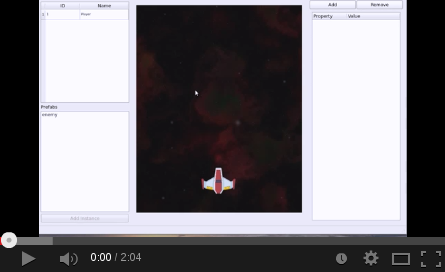
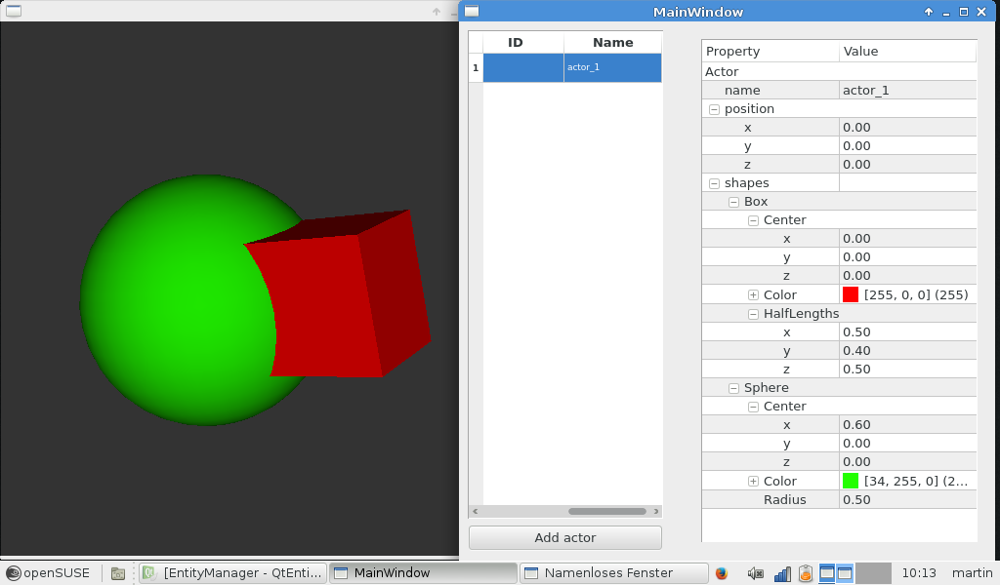
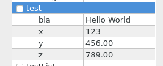
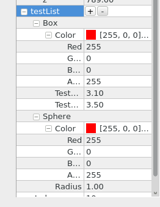

QtEntity
========

QtEntity is a [component entity system](http://en.wikipedia.org/wiki/Entity_component_system).
It helps in the creation of games, simulation systems or other applications
that need to dynamically compose functionality.
Components of a type are stored in consecutive memory blocks, allowing fast iteration.
QtEntity uses the [Qt](http://www.qt-project.org) framework. It includes widgets
and examples that can be used to quickly build tools and editors for displaying and modifying components.
Through the QtScript API it is possible to access components from
the JavaScript language. Serializing components for disk storage or networking
is also supported.
QtEntity does not depend on a specific rendering system or game engine.

Component Entity System Basics
-------------
From  [http://entity-systems.wikidot.com/]
	Entity Systems (ES) are a technique/architecture for building complex extensible projects 
	(mostly: computer games) based around pluggable behaviours and lean, fast, modular data.
	This makes the programming process leaner and easier to extend, with advantages in:
        performance, extensibility, and game-design flexibility

An entity is a set of components. As an example, a spaceship entity may consist of a drawable component,
a physics component, a sound component and a position component. The way the spaceship entity
is composed from components depends on the application being developed and may be done
in a number of ways.

All components of one class are stored in one place. For each component class
there exists one object of the class EntitySystem which holds the component instances and is
responsible for creating, deleting and retrieving them.

Components are indexed by entity ids. An entity id is simply a unique integer
identifying an entity. To get a list of all components of an entity it is necessary to
iterate over all EntitySystems and to query for components indexed by the entity id.

Each entity system can only hold a single component for a given entity id.
To have an entity have lists of something you should not have multiple components of the same type,
instead you should have a single component handling a list of things.

All entity systems are stored in the EntityManager. Usually there is only one EntityManager
in an application. Access to the EntityManager gives access to all entity systems.
The EntityManager provides a number of convenience methods to create, retrieve or delete components
in its systems. It is also responsible for handing out entity ids.

A spaceship example
-------------
Creating a spaceship entity with two components, transform and sprite.

    QtEntity::EntityId spaceShipId = entityManager.createEntityId();
    Transform* transform;
    entityManager.createComponent(spaceShipId, transform);

    QVariantMap args;
    args["path"] = ":/assets/spaceArt.svg";
    Sprite* sprite;
    entityManager.createComponent(spaceShipId, sprite, args);

The third parameter to createComponent accepts a QVariantMap with values for the
component properties - more on that later.

Components
-------------
There is no component class in QtEntity. Instead all classes can be used as components.
Classes used as components have to be added to the Qt metatype system
with the Q_DECLARE_METATYPE macro.

    class ExampleComponent
    {

    public:

       ExampleComponent() : _myValue(0) { }
       double myValue() const { return _myValue; }
       void setMyValue(double v) { _myValue = v; }
    private:
        double _myValue;
    };

    Q_DECLARE_METATYPE(ExampleComponent)

Entity Systems
-------------
Entity systems are used to create, retrieve and delete components. They also give
access to the internal properties of the component.

    class ExampleSystem : public QtEntity::SimpleEntitySystem<ExampleComponent>
    {

    public:
        ExampleSystem(QtEntity::EntityManager* em)
            : SimpleEntitySystem<ExampleComponent>(em)
        {
        }

        virtual QVariantMap toVariantMap(QtEntity::EntityId eid) override
        {
            QVariantMap m;
            ExampleComponent* e;
            if(component(eid, e))
            {
                m["MyValue"] = e->myValue();
            }
            return m;
        }

        virtual void fromVariantMap(QtEntity::EntityId eid, const QVariantMap& m) override
        {
            ExampleComponent* e;
            if(component(eid, e))
            {
                if(m.contains("MyValue")) e->setMyValue(m["MyValue"].toInt());
            }
        }
    };

The toVariantMap() method returns a QVariantMap representation of the component data.
The map entries may or may not correspond to internal
variables of the component.
The fromVariantMap method accepts a QVariantMap and applies its values
in some way to the indexed component.

The QVariantMap representation of components is used by
the QtEntityUtils::EntityEditor widget to show and edit
internal state of components. It can also be used
for serializing components to JSON or other formats.
The method for creating components EntitySystem::createComponent accepts a QVariantMap
of property values which are applied to the component after construction.

Entity Manager
-------------

The entity manager has two responsibilities: Passing out unique entity ids,
and holding entity systems.

	QtEntity::EntityManager em;
        ExampleSystem* ds = new ExampleSystem(&em);

The entity system adds itself to the entity manager. The entity manager takes ownership
of the system.

Now create an entity and add an example component to it:

        QtEntity::EntityId eid = em.createEntityId();

        QVariantMap props;
        props["MyValue"] = 3.1415;
        ExampleComponent* example; em.createComponent(eid, exmple, props);

	// C++11 alternative:
        // auto example = em.createComponent<ExampleComponent>(eid);

You can retrieve components later by doing:

        ExampleComponent* ex; em.getComponent(eid, ex);

Entity System implementations
-------------
EntitySystem is an abstract interface. There a currently two implementations:
SimpleEntitySystem and PooledEntitySystem.
SimpleEntitySystem uses new to create components and delete to delete them. It is
meant to be an easy to understand example implementation.
PooledEntitySystem is a little more sophisticated.
All components are kept in a consecutive memory block.
Newly created components are appended at the end of that memory block,
deleting a component causes the last component in the block to be moved into
the freed location. Creating and deleting components causes all iterators to become
invalid.
Create and delete operations should not be executed while iterating through the system.

Entity Editor
-------------

The entity editor is a Qt widget that can be used to show and modify properties of components.
It shows the entries of the QVariantMap returned by the entity systems holding components
of the entity. Under the hood the entity editor uses the
QtPropertyBrowser (https://qt.gitorious.org/qt-solutions/).
For the different QVariant types different editors are used. For example when a
component has a QColor parameter then a color picker editor is shown.
It is possible to configure the editors. The method EntitySystem::editingAttributes()
may return a QVariantMap with configuration for the QPropertyBrowser editors.
Double parameters are edited with a QDoubleSpinbox widget. To set the step size of a property
named MyValue, return this from editingAttributes():

    QVariantMap myvalueattrs;
    myvalueattrs["singleStep"] = 0.5;
    QVariantMap attrs;
    attrs["MyValue"] = myvalueattrs;
    QVariantMap components;
    components["ExampleComponent"] = attrs;
    return components;

Or when using a compiler supporting c++11 brace init:
    return {"ExampleComponent", {"MyValue", {"singleStep", 0.5}}};

When a property is of type QVariantMap its entries are shown as properties themselves:

This can be used for vector types. Just use a QVariantMap with three entries for x, y and z.

Properties of type QVariantList are shown as editable lists:

The objects available for adding to this list are defined in
the property attributes:

    QVariantMap sphere;
    sphere["Radius"] = 1.0f;
    sphere["Color"] = QColor(255,0,0,255);

    QVariantMap box;
    box["Color"] = QColor(255,0,0,255);
    box["Test0.1"] = 3.1;
    box["Test0.5"] = 3.5;

    QVariantMap prototypes;
    prototypes["Box"] = box;
    prototypes["Sphere"] = sphere;

    QVariantMap attribs;
    attribs["prototypes"] = prototypes;

    QVariantMap test01;
    test01["singleStep"] = 0.1;
    QVariantMap test05;
    test05["singleStep"] = 0.5;

    QVariantMap boxattrs;
    boxattrs["Test0.1"] = test01;
    boxattrs["Test0.5"] = test05;
    attribs["Box"] = boxattrs;

    r["testList"] = attribs;

Items in QVariantLists are not stored directly because there has to be information
about the prototype that was used to create the list entry. QVariantLists contain
ther entries in this format:
    QVariantList l;
    QVariantMap entry1;
    entry1["prototype"] = "Box";
    entry["value"] = box; // A variantmap again.
    l.push_back(entry1);

Scripting
-------------
The EntityManager and EntitySystem classes derive from QObject. This makes
it easy to give QtScript / JavaScript access to its methods.
See tests/test_scripting.h for an example of accessing entity systems from scripts.
